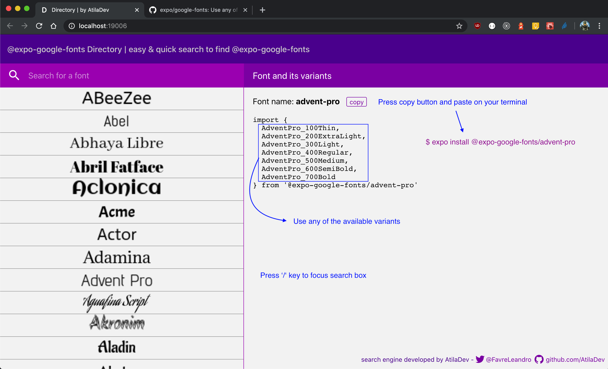

# Directory

`Directory` is an easy & quick search to find @expo-google-fonts to use in your Expo Apps.

## Usage

- If focus isn't on searchbox press '/' key.
- Search for any font (search is not alphabetically, because you can remember a part of font name).
- Press copy button to get the text to install font (e.g: expo install @expo-google-fonts/advent-pro).
- Choose any variant available of font selected.

#### Remember: don't forget to go to [@expo-google-fonts](https://github.com/expo/google-fonts) to read the docs about how to install and use it.

### Author

Leandro Favre
- GitHub ([@AtilaDev](https://github.com/AtilaDev)) - AtilaDev
- Twitter ([@FavreLeandro](https://twitter.com/FavreLeandro))

### Thanks

- Charlie Cheever ([@ccheever](https://github.com/ccheever)) - Expo

## Links

- [@expo-google-fonts](https://github.com/expo/google-fonts)
- [Google Fonts](https://fonts.google.com)
- [Expo](https://expo.dev/)
